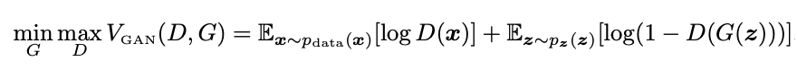
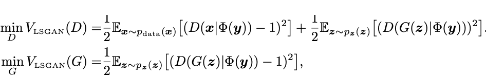
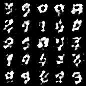
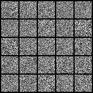
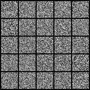

# _*GAN Implementations*_

[Code Reference](https://github.com/eriklindernoren/PyTorch-GAN)   I've referred to this page a lot.
Implementing Serveral Networks in [**pytorch**](https://pytorch.org) with studying it each papers. Welcome any advice with widely open arms.

  

## Datasets
| Dataset | Image source | Download link |
| :----: | ---- | ---- |
| **CelebA** | [Ziwei Liu et al. ICCV 2015](http://mmlab.ie.cuhk.edu.hk/projects/CelebA.html) | [link](https://drive.google.com/drive/folders/0B7EVK8r0v71pWEZsZE9oNnFzTm8) |
| **Set 5** |  [Bevilacqua et al. BMVC 2012](http://people.rennes.inria.fr/Aline.Roumy/results/SR_BMVC12.html)  | [link](https://uofi.box.com/shared/static/kfahv87nfe8ax910l85dksyl2q212voc.zip) |
| **Set 14** |  [Zeyde et al. LNCS 2010](https://sites.google.com/site/romanzeyde/research-interests)  | [link](https://uofi.box.com/shared/static/igsnfieh4lz68l926l8xbklwsnnk8we9.zip) |
| **Urban 100** | [Huang et al. CVPR 2015](https://sites.google.com/site/jbhuang0604/publications/struct_sr)  | [link](https://uofi.box.com/shared/static/65upg43jjd0a4cwsiqgl6o6ixube6klm.zip) |
| **BSD 100** | [Martin et al. ICCV 2001](https://www.eecs.berkeley.edu/Research/Projects/CS/vision/bsds/) | [link](https://uofi.box.com/shared/static/qgctsplb8txrksm9to9x01zfa4m61ngq.zip) |
| **Sun-Hays 80** | [Sun and Hays ICCP 2012](http://cs.brown.edu/~lbsun/SRproj2012/SR_iccp2012.html) | [link](https://uofi.box.com/shared/static/rirohj4773jl7ef752r330rtqw23djt8.zip) |

  

[**Implementations**](#Implementations)
 + [GANs](#Gans)
   + [VanilaGAN](#vanilagan)
   + [DCGAN](#dcgan)
   + [cGAN](#cgan)
   + [LSGAN](#lsgan)
   + [SRGAN](#srgan)
   + [WGAN](#wgan)
   + [WGAN-GP](#wgan-gp)

  

#### VanilaGAN
- Generative Adversarial Network
- Authors
  - [Ian J. Goodfellow | Jean Pouget-Abadie | Mehdi Mirza | Bing Xu | David Warde-Farley | Sherjil Ozair | Aaron Courville | Yoshua Bengio]
    
- [[**Paper**]](https://arxiv.org/abs/1406.2661) | [[**Code**]](./VanilaGAN/VanilaGAN.ipynb)

    

  

#### DCGAN
- Deep Convolutional Generative Adversarial Networks
- Authors 
  - [Alec Radford | Luke Metz | Soumith Chintala]
    

    

- The Main Idea is embedding CNN into the VanilaGAN
- [[**Paper**]](https://arxiv.org/abs/1511.06434) | [[**Code**]](./DCGAN/DCGAN.ipynb)

    

  

#### cGAN

- Conditional Generative Adversarial Nets
- Authors 
  - [Mehdi Mirza | Simon Osindero]
    

    

        
          [The cGAN's scheme]
        
    

    

    
    

- The original GAN can only map one distribution to one output.  **So, the authors introduced that conditional GAN; Conditional probabilistic generative model.** Concatenate condition Y to Disctribution X and Z.

- [[**Paper**]](https://arxiv.org/abs/1411.1784) | [[**Code**]](./cGAN/cGAN.ipynb)

    

        
    

  

#### LSGAN
- Least Squares Generative Adversarial Networks
- Authors 
  - [Xudong Mao | Qing Li | Haoran Xie | Raymond Y.K. Lau | Zhen Wang | Stephen Paul Smolley]
    

    

        
          [The VanilaGANs Loss Function]
        
    

    

    
    

    

        
        [The LSGANs Loss Function]
        
    

    

    
    

- The authors claim that VanilaGAN is UNSTABLE cause of the loss function. Breifly, minimizing the objective function of it suffers from vanishing gradients and it ends up with being hard to train the generator. To Resolve this problem, the authors argue  **"The least squares loss function will penalize the fake samples and pull them toward the decision boundary even though they are correctly classfied. Based on this porperty, LSGANs are able to generate samples that are closer to real data."** 
- [[**Paper**]](https://arxiv.org/abs/1611.04076) | [[**Code**]](./LSGAN/LSGAN.ipynb)

    

  

#### SRGAN

- Super-Resolution Generative Adversarial Networks
- Authors 
  - [Xudong Mao | Qing Li | Haoran Xie | Raymond Y.K. Lau | Zhen Wang | Stephen Paul Smolley]
    

    

        
          [The SRGAN's scheme]
        
    

    

    
    

-  **The optimization target of supervised SR algorithms is commonly the minimization of the MSE between the recovered HR image and the ground truth.**  So, the authors claim that in the reconstructed SR images is typically absent of texture detail. To Resolve this problem, they applied  **A novel perceptual loss using high-levl freature maps of the VGG networks.** Total loss of SRGAN is sum of  weighted Content Loss & Adversarial loss

- [[**Paper**]](https://arxiv.org/abs/1609.04802) | [[**Code1**]](./SRGAN/SRGAN_CelebA.ipynb) | [[**Code2**]](./SRGAN/SRGAN.ipynb)

    

        
          |  Low Resolution  |  High Resolution  |  Generated IMGS
        
    

    

        
    

  

#### WGAN
- Wasserstein Generative Adversarial Networks
- Authors 
  - [Martin Arjovsky | Soumith Chintala | Léon Bottou]
    

    

        
          [The Wasserstein Loss]
        
    

    

    
    

    

        
          [Wasserstein GAN Training Algorithm]
        
    

    

    
    

- The authors shows that  **the Earth-Mover(EM) distance**  might have nice properties somehow when optimized than JS (Jensen-Shannon Divergence) through Theorem 2. 

- [[**Paper**]](https://arxiv.org/abs/1701.07875) | [[**Code**]](./WGAN/WGAN.ipynb)

    

  

#### WGAN-GP
- Wasserstein Generative Adversarial Networks with Gradient Penalty
- Authors
  - [Ishaan Gulrajani | Faruk Ahmed | Martin Arjovsky | Vincent Dumoulin | Aaron Courville]
    

    

        
          [The WGAN-GP's Training Algorithm]
        
    

    

      
    

- The authors claim that WGAN made a great progress toward stable training of GANs, but sometimes cna still generate only poor samples or fail to converge and  **it is often due to the use of clipping in WGAN. So they proposed a penalizing the norm of gradient fo the critic w.r.t to its input.** 
-  **The only difference to original WGAN is using gradient penalty instead of clipping the weights of critic.** 

- [[**Paper**]](https://arxiv.org/abs/1704.00028) | [[**Code**]](./WGAN-GP/WGAN-GP.ipynb)

    

