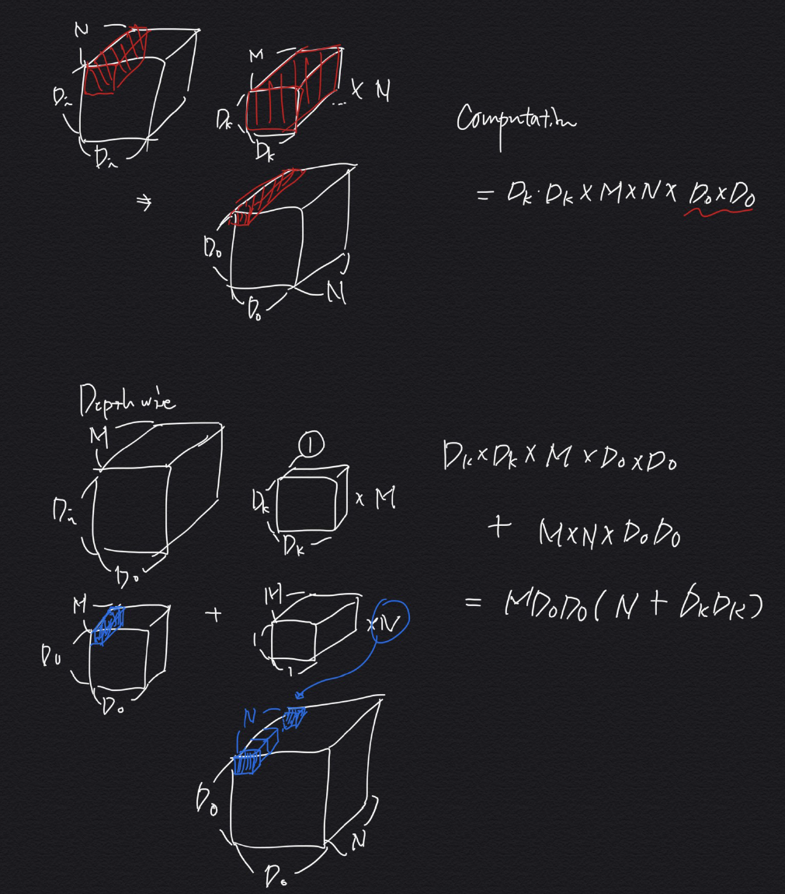

# _*MobileNets Implementation*_

Implementing MobileNets in [**pytorch**](https://pytorch.org).  
Welcome any advice with widely open arms.

  
# Todo
- [x] MobileNet version 1
- [x] MobileNet version 2
- [ ] MobileNet version 3
- [ ] Training MobileNets on ImageNet Dataset...

  
# Version 1
- MobileNets: Efficient Convolutional Neural Networks for Mobile Vision
Applications
- Authors
  - [Andrew G. Howard | Menglong Zhu | Bo Chen | Dmitry Kalenichenko |
Weijun Wang | Tobias Weyand | Marco Andreetto | Hartwig Adam]
    
- [[**Paper**]](https://arxiv.org/abs/1704.04861) | [**[Code]**](./V1/model.py)
- Introduce a **Depthwise convolution** which is consist of two layers, depthwise and pointwise convolutions.
It had similar performance to normal(original?) convolution, however it does have lower computation cost.

    

  

  
# Version 2
- MobileNetV2: Inverted Residuals and Linear Bottlenecks
- Authors
  - [Mark Sandler | Andrew Howard | Menglong Zhu | Andrey Zhmoginov | Liang-Chieh Chen]
    
- [[**Paper**]](https://arxiv.org/abs/1801.04381) | [**[Code]**](./V2/model.py)
- Introduce a **Inverted Residual and Linear Bottlenecks** Relu is capable of preserving complete information about the input manifold,
 but only if the input manifold lies in a low-dimensional subspace. So, in MobileNet version 2, we are gonna use Inverted Residual block,
 which using relu in a lower dimension and expanding it into a higher dimension following a linear transformation.
 Using linear layers is crucial as it prevents non-linearities from destroying too much information.