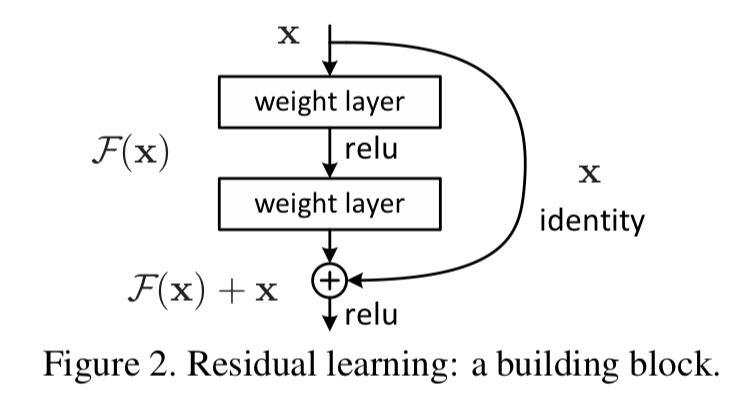

# _*ResNet Implementation*_

Implementing ResNet in [**pytorch**](https://pytorch.org).  
Welcome any advice with widely open arms.
  

- Deep Residual Learning for Image Recognition
- Authors
  - [Kaiming He | Xiangyu Zhang | Shaoqing Ren | Jian Sun]
    
- [[**Paper**]](https://arxiv.org/abs/1512.03385) | [[**Code**]](./ResNet.py)
- Due to Vanishing & Exploding gradients, we cannot sure that a deeper networks perform better. When deepeer networks start to converge, **Degradation problem** occurs.
- The authors deal with Degradation problems by **Residual Learning**. Short connections give a reference so easier to optimize than unreferenced(original mapping function).
- The goal is finding F(x) instead of a direct mapping function H(x); which is F(x) + x.

    

- H(x) is way more complicated than F(x), so it's surely hard to optimize. Once we can find easier function F(x), then we can simply optimizer H(x) by adding the short connection x to F(x)
  