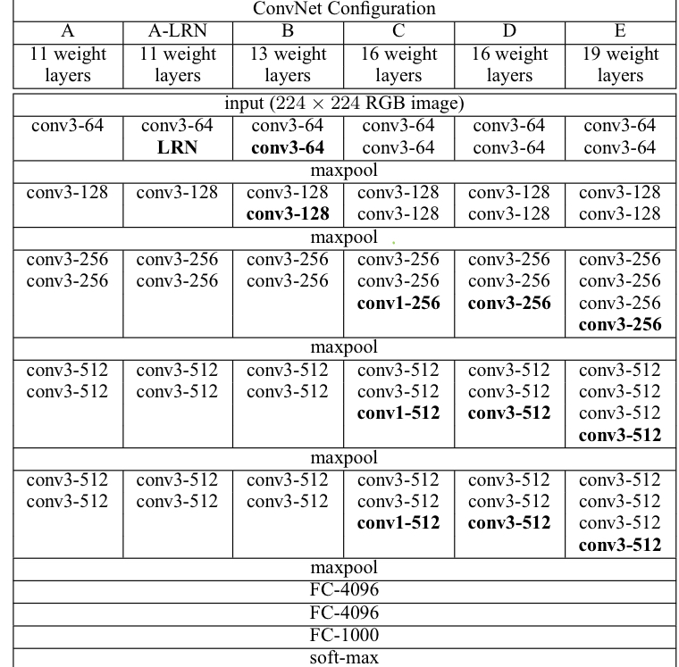

# _*VGG Implementation*_

Implementing VGG Networks in [**pytorch**](https://pytorch.org).  
Welcome any advice with widely open arms.
  

- Very Deep Convolutional Networks For Large-Scale Image Recognition
- Authors
  - [Karen Simonyan | Andrew Zisserman]
    
- [[**Paper**]](https://arxiv.org/abs/1409.1556) | [[**Code**]](./VGG.py)

    

  
