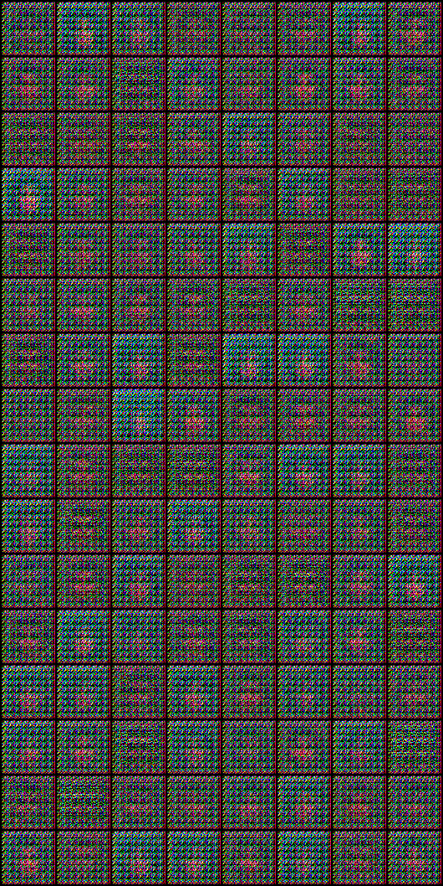

# _*Pytorch Implementations*_

[Code Reference](https://github.com/eriklindernoren/PyTorch-GAN)   I've referred to this page a lot.
Implementing Serveral Networks in [**pytorch**](https://pytorch.org) with studying it each papers. Welcome any advice with widely open arms.

  

## Datasets
| Dataset | Image source | Download full results |
| :----: | ---- | ---- |
| **CelebA** | [Large-scale CelebFaces Attributes (CelebA) Dataset](http://mmlab.ie.cuhk.edu.hk/projects/CelebA.html) | [link](https://drive.google.com/drive/folders/0B7EVK8r0v71pWEZsZE9oNnFzTm8) (1.3 GB)|
| **Set 5** |  [Bevilacqua et al. BMVC 2012](http://people.rennes.inria.fr/Aline.Roumy/results/SR_BMVC12.html)  | [link](https://uofi.box.com/shared/static/kfahv87nfe8ax910l85dksyl2q212voc.zip) (16.1 MB)|
| **Set 14** |  [Zeyde et al. LNCS 2010](https://sites.google.com/site/romanzeyde/research-interests)  | [link](https://uofi.box.com/shared/static/igsnfieh4lz68l926l8xbklwsnnk8we9.zip) (86.0 MB)|
| **Urban 100** | [Huang et al. CVPR 2015](https://sites.google.com/site/jbhuang0604/publications/struct_sr)  | [link](https://uofi.box.com/shared/static/65upg43jjd0a4cwsiqgl6o6ixube6klm.zip) (1.14 GB)|
| **BSD 100** | [Martin et al. ICCV 2001](https://www.eecs.berkeley.edu/Research/Projects/CS/vision/bsds/) | [link](https://uofi.box.com/shared/static/qgctsplb8txrksm9to9x01zfa4m61ngq.zip) (568 MB)|
| **Sun-Hays 80** | [Sun and Hays ICCP 2012](http://cs.brown.edu/~lbsun/SRproj2012/SR_iccp2012.html) | [link](https://uofi.box.com/shared/static/rirohj4773jl7ef752r330rtqw23djt8.zip) (311 MB)|

  

[**Implementations**](#Implementations)
 + [GANs](#Gans)
   + [VanilaGAN](#vanilagan)
   + [DCGAN](#dcgan)
   + [LSGAN](#lsgan)
   + [SRGAN](#srgan)

  

#### VanilaGAN
- Generative Adversarial Network
- Authors 
  - [Ian J. Goodfellow | Jean Pouget-Abadie | Mehdi Mirza | Bing Xu | David Warde-Farley | Sherjil Ozair | Aaron Courville | Yoshua Bengio]
    
- [[**Paper**]](https://arxiv.org/abs/1406.2661) | [[**Code**]](./Implementations/GANs/VanilaGAN/VanilaGAN.ipynb)

    

#### DCGAN
- Deep Convolutional Generative Adversarial Networks
- Authors 
  - [Alec Radford | Luke Metz | Soumith Chintala]
    

    

- The Main Idea is embedding CNN into the VanilaGAN
- [[**Paper**]](https://arxiv.org/abs/1511.06434) | [[**Code**]](./Implementations/GANs/DCGAN/DCGAN.ipynb)

    

#### LSGAN
- Least Squares Generative Adversarial Networks
- Authors 
  - [Xudong Mao | Qing Li | Haoran Xie | Raymond Y.K. Lau | Zhen Wang | Stephen Paul Smolley]
    

    

        
          The VanilaGANs Loss Function
        
    

    

    
    

    

        
        The LSGANs Loss Function
        
    

    

    
    

- The authors claim that VanilaGAN is UNSTABLE cause of the loss function. Breifly, minimizing the objective function of it suffers from vanishing gradients and it ends up with being hard to train the generator. To Resolve this problem, the authors argue  **"The least squares loss function will penalize the fake samples and pull them toward the decision boundary even though they are correctly classfied. Based on this porperty, LSGANs are able to generate samples that are closer to real data."** 
- [[**Paper**]](https://arxiv.org/abs/1611.04076) | [[**Code**]](./Implementations/GANs/LSGAN/LSGAN.ipynb)

    

#### SRGAN

- Super-Resolution Generative Adversarial Networks
- Authors 
  - [Xudong Mao | Qing Li | Haoran Xie | Raymond Y.K. Lau | Zhen Wang | Stephen Paul Smolley]
    

    

        
          The SRGAN's scheme
        
    

    

    
    

-  **The optimization target of supervised SR algorithms is commonly the minimization of the MSE between the recovered HR image and the ground truth.**  So, the authors claim that in the reconstructed SR images is typically absent of texture detail. To Resolve this problem, they applied  **A novel perceptual loss using high-levl freature maps of the VGG networks.** Total loss of SRGAN is sum of  weighted Content Loss & Adversarial loss

- [[**Paper**]](https://arxiv.org/abs/1609.04802) | [[**Code1**]](./Implementations/GANs/SRGAN/SRGAN_CelebA.ipynb) | [[**Code2**]](./Implementations/GANs/SRGAN/SRGAN.ipynb)

    

        
          |  Low Resolution  |  High Resolution  |  Generated IMGS
        
    

    

        
    

